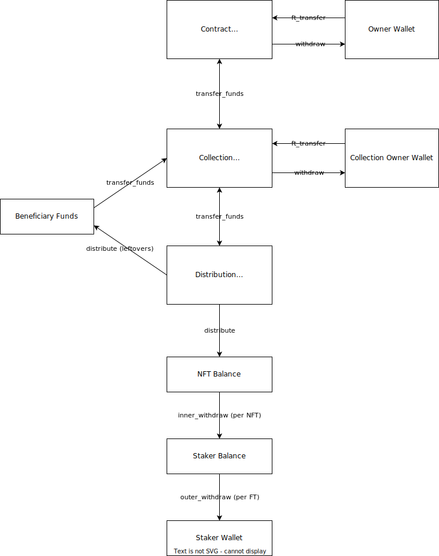

# Balances and Operations

In a financial application it's very important to be careful with assets. Even more so in a decentralized setting, where little manual intervention is possible. We have devised a scheme of internal balances that enables the NFT Staking Contract to operate autonomously without losing track of which funds belong to each protocol participant (which is unacceptable). In the interest of elucidating both future maintainers and stakeholders about the project's previous technical decisions, we will describe the motivation behind each balance, as well as which operations are allowed, by each operator, betweem them.

## Balances
### Distribution Funds
The core functionality of the contract revolves around the *Distribution Funds*. There's one for each staking program, and it's the pool of tokens that will be distributed as rewards to stakers.

### Contract Treasury
Holds the bulk of contract tokens, which can then be routed to individual staking programs. Only the owner can withdraw from it, but anyone can deposit (partners, for example).

### Collection Treasury
Holds both program and contract tokens to be distributed. 

### Staked NFT Balance
Where most of the distributed tokens will initially go to.

### Staker Balance
Receives funds from *Staked NFT Balances* associated with the staker's NFTs. It exists for technical reasons better described in the [inner and outer withdrawals section](#inner_withdraw-and-outer_withdraw). There's one for each pair of staker and staking program. Could be refactored later so there's only one per staker.

### Beneficiary Funds
It solely exists to hold leftover funds when a staking program gets fully distributed.

## Operations
### `distribute`

Distributes rewards from the program's *Distribution Funds* pool to each *Staked NFT Balance*.

If during distribution the remaining funds are lower than the round's reward, the funds will go to the program's *Beneficiary Funds*.

It's lazily executed whenever an update to a staked NFT happens (staking, unstaking or claiming rewards). Technically the NFTs' balances are only effectively updated when the rewards are claimed, and `distribute` only updates the RPS, but that's only an implementation detail, as the difference between the farm's RPS and a NFT RPS is sufficient to determine how many tokens its balance should have.

### `inner_withdraw` and `outer_withdraw`

The existence of these transactions is purely for a technical reason. When combined they allow a staker to withdraw their rewards. While `inner_withdraw` transfers a *Staked NFT Balance* to the respective *Staker Balance*, `outer_withdraw` allows the staker to withdraw a specific fungible token from their *Staker Balance* to their *Staker Wallet*.

As the Near API allows for batch calls, this won't be noticed by the user in the frontend. However CLI users need to be aware of these details.

There are two motivations behind this separation:
1. It allows for the `unstake` procedure to only issue a single cross-contract call, which is the `nft_transfer`, while `ft_transfer` will only happen when the staker withdraws their balance. This reduces error handling complexity substantially.
2. It enables the contract to scale appropriately when batching multiple `unstake` calls together. If to unstake each NFT the contract transfered its balance directly to the *Staker Wallet*, it would result in `O(m * n)` cross-contract calls, where `m` is the number of NFTs and `n` the number of FTs. This implementation achieves the same effect in `O(m + n)` cross-contract calls instead.

### `transfer_funds`

Handles transfers between internal balances. Does not deal with withdrawals.

Routes the transfer to the corresponding function based on a `TransferOperation` value, of the following (self-describing) variants:
- `ContractToCollection`
- `CollectionToContract`
- `CollectionToDistribution`
- `BeneficiaryToCollection`

### `ft_transfer`

In order to deposit fungible tokens to be distribtued by the contract, it's necessary to issue a `ft_transfer` call to the respective fungible token's contract. The FT Contract will then call `ft_on_transfer` on the NFT Staking Contract, which will deal with the transfer based on its parameters.

Notably the `msg` parameter specifies the kind of deposit. The contract will then route the call to the corresponding function. Currently there's only a `Deposit` route, which receives a `DepositOperation` value, of the following (self-describing) variants:
- `ContractTreasury`
- `CollectionTreasury`

### `withdraw`

Denotes an operation that withdraws funds from a treasury to a wallet.

## Contract API Calls

The diagram show only abstract operations, which are incorporated inside functions the users may call. The following list shows which functions on the contract's public interface perform which operations:

- `claim_reward`: calls `inner_withdraw` without unstaking the NFT
- `unstake`: calls `inner_withdraw`, unstakes the NFT and transfers it back to the staker
- `withdraw_rewards`: calls `outer_withdraw` to transfer the funds in *Staker Balance* to the *Staker Wallet*
- `ft_on_transfer`: routes the deposit to the corresponding function (see [the `ft_transfer` section](#ft_transfer))
- `withdraw_collection_treasury`: withdraws funds from *Collection Treasury* to *Collection Owner Wallet*
- `withdraw_contract_treasury`: withdraws funds from *Contract Treasury* to *Owner Wallet*
- `transfer`: calls `transfer_funds`

## Operators, Contract and Program Tokens
The authorization logic behind internal balances transfers is based on the concept of contract and program tokens.

Contract tokens are common to every staking program, and are in custody of the owner and guardians. Program tokens are specific to each staking program, and are in custody of the collection owner.

Guardians and collection owners can only operate on their respective tokens. However, if for any reason there's a staking program whose program token is a contract token, guardians will not be able to operate on it.

In the context of a balance operation that could be performed by either guardians or the collection owner (on their respective tokens), these actors are called _operators_. Most of the operation logic is the same when performed by either kind of operator, except which tokens they are authorized to operate on.